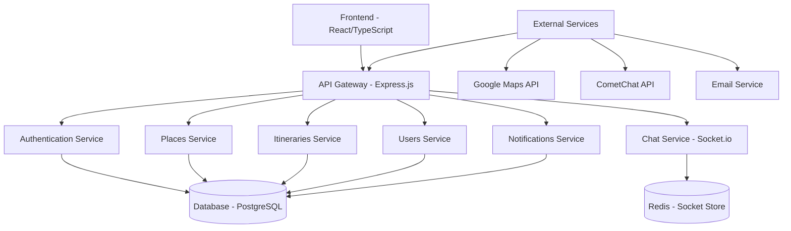
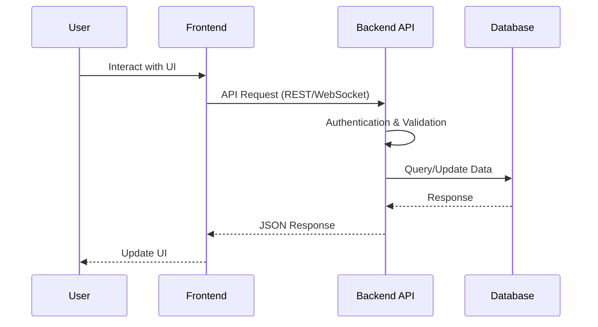
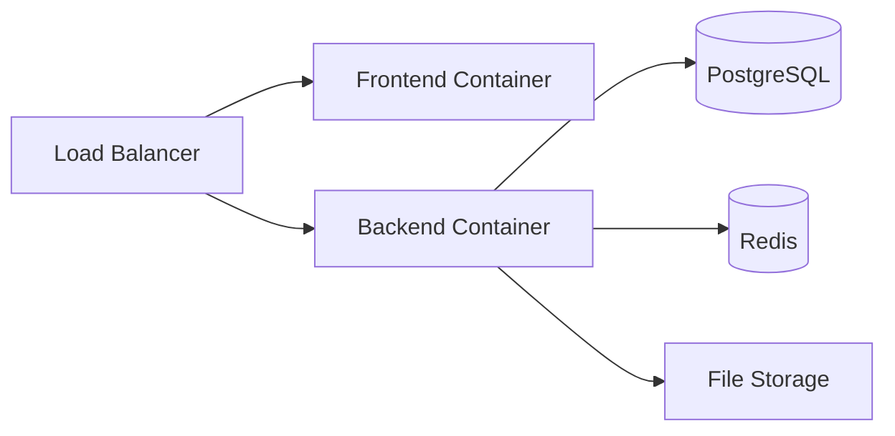

# Technical Documentation

## Architecture Overview

JoinTravel is built as a full-stack web application with a modern, scalable architecture designed for travel planning and social interaction.

### System Architecture



### Data Flow



## Technology Stack

### Frontend
- **Framework**: React 19 with TypeScript
- **Build Tool**: Vite
- **UI Library**: Material-UI (MUI) v7
- **Routing**: React Router v7
- **State Management**: React Context + Hooks
- **HTTP Client**: Axios
- **Real-time**: Socket.io Client
- **Maps**: Google Maps React Wrapper
- **Chat**: CometChat UIKit React
- **Drag & Drop**: @dnd-kit
- **File Upload**: FilePond
- **Markdown**: React Markdown

### Backend
- **Runtime**: Node.js with ES Modules
- **Framework**: Express.js v5
- **Database ORM**: TypeORM
- **Database**: PostgreSQL (production and testing envs)
- **Authentication**: JWT + bcrypt
- **Real-time**: Socket.io
- **API Docs**: Swagger/OpenAPI
- **Email**: Nodemailer
- **Rate Limiting**: express-rate-limit
- **AI Integration**: LangChain and Grok + Agentic itinerary creation
- **Logging**: Winston

## API Design

### RESTful Endpoints

The API follows REST conventions with the following base structure:

```
GET    /api/auth/login          - User authentication
POST   /api/users               - Create user profile
GET    /api/places              - List places
POST   /api/itineraries         - Create itinerary
GET    /api/chat/messages       - Get chat messages
WS     /socket.io/              - Real-time events
```

### Authentication

JWT-based authentication with refresh tokens:

```javascript
// Request headers
Authorization: Bearer <access_token>

// Response on token expiry
HTTP 401 Unauthorized
{
  "error": "Token expired",
  "refresh_url": "/api/auth/refresh"
}
```

### Real-time Communication

WebSocket events for live features:

```javascript
// Client connection
socket.emit('join_group', { groupId });

// Server broadcasts
socket.emit('new_message', messageData);
socket.emit('user_joined', userData);
```

## Database Schema

### Core Entities

```sql
-- Users
CREATE TABLE users (
  id UUID PRIMARY KEY,
  email VARCHAR UNIQUE,
  username VARCHAR UNIQUE,
  avatar_url VARCHAR,
  level INTEGER DEFAULT 1,
  experience_points INTEGER DEFAULT 0
);

-- Places
CREATE TABLE places (
  id UUID PRIMARY KEY,
  name VARCHAR,
  description TEXT,
  latitude DECIMAL,
  longitude DECIMAL,
  category VARCHAR
);

-- Itineraries
CREATE TABLE itineraries (
  id UUID PRIMARY KEY,
  user_id UUID REFERENCES users(id),
  title VARCHAR,
  description TEXT,
  start_date DATE,
  end_date DATE
);

-- Reviews
CREATE TABLE reviews (
  id UUID PRIMARY KEY,
  user_id UUID REFERENCES users(id),
  place_id UUID REFERENCES places(id),
  rating INTEGER,
  comment TEXT,
  created_at TIMESTAMP
);
```

## Deployment Architecture

### Production Setup



### Docker Configuration

Multi-stage builds for optimized images:

- **Frontend**: Node.js → Nginx static serving
- **Backend**: Node.js → Production runtime
- **Database**: PostgreSQL with persistent volumes

## Security Measures

- **CORS**: Configured for allowed origins
- **Helmet**: Security headers
- **Rate Limiting**: API endpoint protection
- **Input Validation**: Zod schemas for all inputs
- **SQL Injection**: TypeORM query builders
- **XSS Protection**: React's built-in sanitization
- **CSRF**: JWT stateless authentication

## Performance Optimizations

- **Frontend**: Code splitting, lazy loading, optimized bundles
- **Backend**: Database indexing, query optimization
- **Caching**: Redis for session/chat data
- **CDN**: Static assets delivery
- **Compression**: Gzip/Brotli for responses

## Monitoring & Logging

- **Application Logs**: Winston with structured logging
- **Error Tracking**: Global error handlers
- **Health Checks**: `/health` endpoint
- **Metrics**: Response times, error rates
- **Database Monitoring**: Connection pooling status

## Development Workflow

### Local Development
```bash
# Frontend
cd front && pnpm install && pnpm dev

# Backend
cd back && pnpm install && pnpm dev
```

### Testing
```bash
# Unit tests
pnpm test

# Integration tests
pnpm test:e2e

# API testing
# Access http://localhost:3005/docs
```

### Code Quality
- **Linting**: ESLint with React/TypeScript rules
- **Formatting**: Prettier configuration
- **Pre-commit Hooks**: Husky for quality gates